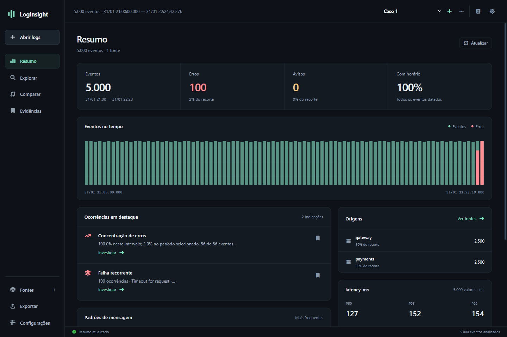
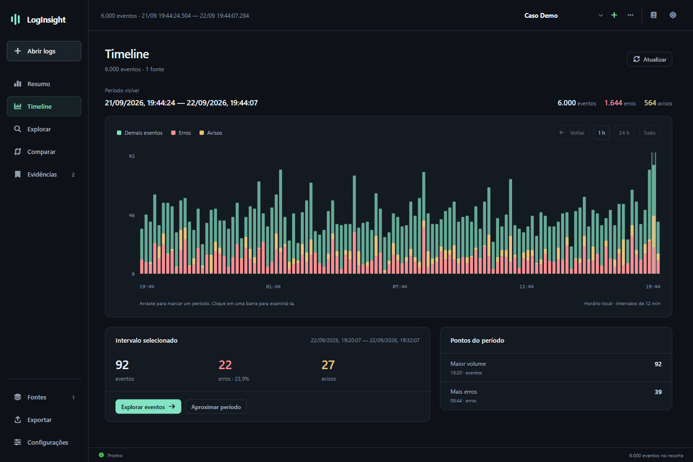

# LogInsight — reformulação e validação

Implementação em 22/09/2026. A avaliação inicial permanece em `avaliacao-produto-e-evolucao.md` como registro do diagnóstico; este documento descreve o que foi entregue.

## Experiência

- Navegação principal: **Resumo, Atividade, Linha do tempo, Explorar, Comparar, Evidências e Fontes**.
- Interface em grafite e verde suave, tema claro, menos texto e prioridade para os dados. Revisão visual em 1440×960 e 1024×768.
- Abrir arquivos, pastas e arquivos arrastados; adicionar fontes preservando o conjunto e reabrir conjuntos mistos.
- Resumo com contagens completas, cobertura de horário, distribuição temporal, padrões de mensagem, concentração de erros, lacunas e percentis de latência.
- Timeline em tela própria, com volume e gravidade por intervalo, escala no horário local, seleção por clique ou arraste, aproximação, retorno ao período anterior e abertura do recorte no explorador. A contagem é exata para o período visível e inclui avisos, erros e intervalos vazios. Eventos sem horário são identificados separadamente.
- Linha do tempo do caso em modos vertical e horizontal: dia abreviado uma vez por seção, horário em cada ocorrência, marcas curtas junto ao eixo e agrupamento automático de eventos consecutivos semelhantes. É possível selecionar e agrupar ocorrências, mover nomes para o outro lado, editar título e cor, criar marcos e adicionar notas com ícone ou texto. As curvas das notas podem ter pontas opcionais, traço contínuo, tracejado ou pontilhado, e um ponto arrastável para ajustar o trajeto. As posições das notas e o ajuste das curvas são guardados separadamente para cada modo.
- Clicar em um padrão, origem ou intervalo leva ao recorte correspondente. Os achados são indicações verificáveis, não diagnóstico automático de causa.
- Comparação de dois períodos, contagens e participação relativa dos padrões. Períodos sobrepostos são rejeitados.
- Exploração com busca de campos, favoritos, quebra de linhas, densidade, desfazer filtros e atalhos.
- Detalhes com contexto temporal, seguir identificador de requisição e salvar evidência.
- Evidências com registro original, referência da fonte, anotação, reabertura do recorte, exportação, importação de investigação e desfazer remoção.
- Exportação completa do recorte em JSONL e CSV; CSV descobre os campos do conjunto e protege células que poderiam ser interpretadas como fórmulas. Opção de ocultar senhas/tokens reconhecidos antes da serialização. A ocultação é heurística e não constitui garantia de anonimização.
- Configuração de data/hora por fonte, fuso explícito e ajuste de relógio.

## Motor e persistência

- Índice composto por arquivos mapeados e offsets; unir arquivos não converte todo o conjunto em objetos de eventos na memória.
- Índices persistentes com identificação da versão da fonte, formato e configuração de parser; cache inválido é reconstruído.
- GZ descompactado em fluxo, preservando o nome original na análise.
- EVTX e canais Windows lidos pelo leitor nativo, com materialização em arquivo temporário indexado. Os canais mantêm o limite configurável de até 100 mil registros; EVTX não usa esse limite.
- Séries e tabelas dinâmicas percorrem a seleção completa. Foi removido o corte silencioso dos primeiros 50 mil registros.
- Contagem distinta exata com transbordamento para SQLite temporário.
- Cancelamento cooperativo no backend. Importação prepara a nova fonte antes de publicar; uma falha/cancelamento conserva a anterior.
- Referência estável por versão de arquivo/posição e trilhas que usam IDs reais, inclusive em subconjuntos esparsos.
- Casos em SQLite, transações, revisão otimista e migração do JSON antigo, preservando os arquivos originais. A gravação atualiza apenas os casos modificados. Corrupção e conflito não são tratados como sucesso.
- MCP com ativação pela interface, chave local, validação de Host e rejeição de Origin de navegador. A configuração dos clientes inclui o cabeçalho de autenticação. Instalações novas iniciam desativadas; a preferência de instalações existentes é preservada.
- Correção do `connect-src` do Tauri para o protocolo IPC interno.

## Validação realizada

- **19 testes automáticos passaram**, sem falhas: parsers, formato customizado, paridade memória/índice, regex ancorada, Unicode escapado, códigos CEF, fuso, referências, trilhas, contagem distinta, séries além de 50 mil registros, comparação, cache, cancelamento e migração/conflito/corrupção da persistência.
- A suíte contém três testes optativos. O benchmark novo foi executado separadamente em release e passou. Os dois testes antigos que dependem de corpus externo/extração de provedores não foram executados.
- Fluxos no preview: busca, detalhes, evidência, anotação, exportação, comparação, fontes, configurações, temas e janela reduzida.
- Aplicativo **Tauri nativo**, com diretório de dados isolado: importação de 5 mil registros sintéticos, união com GZ (10 mil registros), origem dos arquivos, resumo com 100 erros esperados, preservação durável de evento bruto/referência, cancelamento mantendo a fonte anterior, EVTX e canal Application limitado a 25 eventos.
- MCP nativo: autenticação válida aceita; ausência de chave, chave inválida e Origin de navegador rejeitados.
- Build Windows release realizado com `npm run build`: executável em `src-tauri/target/release/loginsight.exe` e instaladores NSIS (`.exe`) e MSI em `src-tauri/target/release/bundle/`.

### Builds de distribuição — Windows e Linux

A [execução 35727273500](https://github.com/felipevasc/logs/actions/runs/35727273500) compilou o commit `ca8258063ab39ee8be3f05389bb81c941d1c3f45` com Rust 1.98.1 e Node.js 22. Os dois jobs terminaram com sucesso.

| Plataforma | Testes em release | Pacotes x64 |
| --- | --- | --- |
| Windows Server 2022 | 19 passaram, 0 falharam, 3 optativos ignorados | NSIS `.exe` e `.msi` |
| Ubuntu 22.04 | 18 passaram, 0 falharam, 1 optativo ignorado | `.deb`, `.rpm` e `.AppImage` |

Os arquivos foram baixados para `output/releases/0.1.0/`. Os SHA-256 dos dois arquivos ZIP foram comparados com os hashes publicados pelo GitHub; os ZIPs passaram pela verificação de integridade. Também foram conferidos os tipos dos cinco pacotes e os metadados do `.deb`. Os hashes individuais estão em `output/releases/0.1.0/SHA256SUMS.txt`.

Os artefatos do GitHub ficam disponíveis por 30 dias. O workflow pode ser executado novamente pela aba Actions. Os instaladores não possuem assinatura de código. A validação do Linux abrange compilação, testes do backend e estrutura dos pacotes; a interface gráfica no Linux ainda não foi exercitada.

### Medição de arquivo grande

Corpus sintético de **1.073.741.784 bytes**, **1.091.201 eventos JSONL**, mensagens repetidas e timestamps iguais. Execução release neste computador:

| Operação | Tempo |
| --- | ---: |
| Indexação inicial + gravação do índice | 5,12 s |
| Reabertura do índice persistente | 0,073 s |
| Primeira página, ordenação temporal | 0,036 s |
| Página seguinte | 0,030 s |
| Resumo completo | 15,82 s |

Isso comprova esse cenário, não constitui promessa para outros formatos, alta cardinalidade, armazenamento ou arquivos de 10–50 GB. O teste não mediu pico de memória nem tempo total de importação mais facetas e resumo na interface.

Para repetir:

```powershell
$env:LOGINSIGHT_DATA_DIR = "$PWD/output/benchmark-data"
$env:BENCH_MB = "1024"
$env:BENCH_RESULT = "$PWD/output/benchmark-1g.json"
cargo test --manifest-path src-tauri/Cargo.toml --release benchmark_large_index -- --ignored --nocapture
```

## Limites explícitos e próximos passos

- Perfis de campos usam até 3 mil eventos distribuídos; descoberta inicial de colunas usa até 4 mil. O tamanho da amostra é exposto. Campos raros continuam preservados no evento bruto/JSONL e são descobertos na exportação CSV completa.
- Padrões têm orçamento de 20 mil grupos; a interface avisa quando ele é atingido. O resumo mostra os padrões/origens mais frequentes, mantendo as contagens gerais completas.
- Percentis acima de 10 mil valores usam amostragem de reservatório identificada na interface; valores de unidades incompatíveis não são misturados silenciosamente.
- Tabelas dinâmicas informam quando seu orçamento de células/colunas/linhas é atingido. Não apresentam o resultado parcial como completo.
- A indexação precisa terminar antes de consultar uma nova fonte. Leitura incremental de arquivos em crescimento, prévia durante a primeira indexação, orçamento/limpeza automática de cache, corpus de 10–50 GB, edição de parsers por exemplo e recursos de colaboração continuam como evolução futura.
- A integração MCP continua compartilhando a fonte ativa do aplicativo. Ainda não há isolamento de conjuntos por cliente ou permissões individuais por ferramenta.
- Os arquivos expandidos e snapshots de Event Log ficam no diretório de configuração. Não foi adicionado um gerenciador de retenção.
- O instalador assinado e a atualização automática não fazem parte desta entrega; o executável release foi gerado e testado localmente.

## Registro visual





A última tentativa de reabrir o executável para repetir os testes nativos após os ajustes finais foi bloqueada pela revisão automática, com a mensagem genérica 'blocked by policy'. Os testes nativos descritos acima foram realizados antes desse bloqueio; a compilação final e as verificações de código continuaram disponíveis.

A revisão automática também bloqueou a remoção do diretório de testes. Os arquivos temporários permanecem em `output/native-test`, que é ignorado pelo Git.
