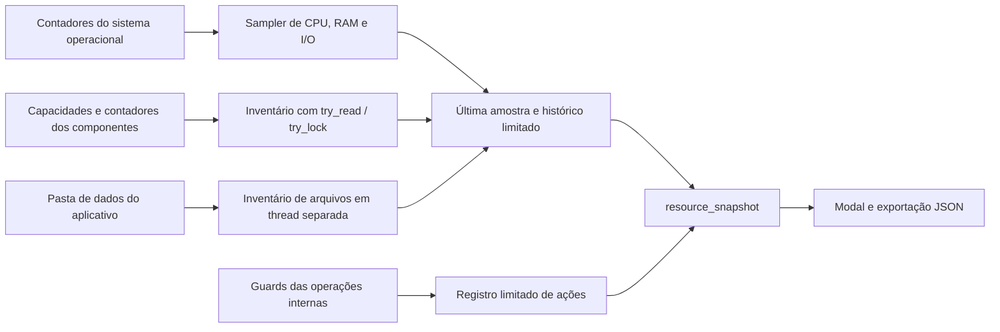

# Gerenciador de recursos

O gerenciador mostra consumo do LogInsight, seus processos auxiliares e o sistema operacional. Ele acompanha a execução inteira: trocar de Caso, fechar o modal ou pausar a atualização visual não reinicia a coleta. O histórico fica em memória e recomeça ao abrir outra execução do aplicativo.

Abra pelo botão de velocímetro **Gerenciador de recursos**, no cabeçalho, ao lado de Exportar. O painel funciona também sem Caso aberto. É possível escolher CPU, RAM ou I/O e janelas de um, cinco ou 15 minutos; pausar apenas a atualização visual, atualizar manualmente e exportar os dados exibidos em JSON. O botão de tarefas abre o painel já existente de operações em andamento.

As medidas do sistema operacional, as estimativas por componente, os créditos de trabalho, os limites configurados e os tamanhos de arquivos têm bases diferentes. O painel identifica essa base e preserva valores indisponíveis como `null`; zero significa que o contador foi obtido e seu valor foi zero.

## Coleta e fluxo dos dados



`resource_monitor.rs` inicia um coletor de aproximadamente uma amostra por segundo. O tempo gasto na coleta é descontado do intervalo; quando uma coleta demora mais, o histórico recebe menos amostras em vez de criar uma fila. A retenção é limitada por tempo e por quantidade: até 900 amostras e até 15 minutos em condições normais do relógio do sistema. Os intervalos de CPU, I/O e duração das ações usam relógio monotônico; os horários exibidos usam o relógio civil.

O inventário de arquivos roda em outra thread, aproximadamente a cada 30 segundos. O modal consulta a última amostra pronta. Abrir o painel não cria outro sampler, inicia análise de logs ou percorre os diretórios. O mutex do armazenamento compartilhado protege apenas a publicação e a cópia dos resultados limitados.

## CPU e processos próprios

A família começa no PID do backend. O sampler descobre descendentes pelas relações de parentesco e preserva descendentes já observados quando um pai intermediário termina. A identidade inclui PID e horário de início. Um processo não é incorporado apenas por ter nome de WebView. A lista global é usada para descoberta; detalhes dos processos de outros aplicativos não são enviados ao painel.

A porcentagem do aplicativo é normalizada pela quantidade de processadores lógicos. Assim, 100% representa a capacidade agregada da máquina. O campo `oneCoreCpuPercent` mantém a escala em que um núcleo completamente ocupado corresponde a 100%. A diferença de tempo de CPU acumulado é dividida pelo tempo monotônico entre leituras; no Windows, o contador inclui tempo de usuário e kernel em unidades de 100 ns. [GetProcessTimes](https://learn.microsoft.com/en-us/windows/win32/api/processthreadsapi/nf-processthreadsapi-getprocesstimes).

Um processo novo precisa de duas leituras antes de produzir uma taxa. Ausência do contador, redução inesperada do acumulado ou intervalo insuficiente produz `null`. O total da família também fica indisponível quando algum processo observado não tem a medida necessária; não apresenta uma soma incompleta como total medido. Processos muito breves podem nascer e terminar entre amostras e não ser observados. Uma amostra não é uma captura atômica de todos os processos.

Informações gerais de CPU, memória e volumes usam `sysinfo` 0.37.2. Frequência depende do dado fornecido pelo sistema; valor não disponível não é tratado como frequência medida. O intervalo mínimo da biblioteca é respeitado para a medida global de CPU. [API e implementação de System](https://github.com/GuillaumeGomez/sysinfo/blob/v0.37.2/src/common/system.rs).

## Memória: residente, commit, virtual e inventário

No Windows, a RAM mostrada por processo é o working set atual, e o segundo contador é o commit privado. Esse commit não significa que todos esses bytes estão residentes. Os campos vêm de `PROCESS_MEMORY_COUNTERS_EX`. [Definições dos contadores de memória](https://learn.microsoft.com/en-us/windows/win32/api/psapi/ns-psapi-process_memory_counters_ex).

No Linux, os contadores vêm de `/proc/<pid>/stat` e `statm`: RSS e tamanho do espaço virtual. O tamanho das páginas e a frequência dos ticks são obtidos do sistema, sem assumir constantes. RSS é aproximado e pode incluir páginas compartilhadas. [Documentação do kernel sobre `/proc`](https://www.kernel.org/doc/html/latest/filesystems/proc.html).

A RAM da família é a soma do residente de seus processos. Páginas compartilhadas podem aparecer em vários processos; portanto, esse total não é uma medida de memória física exclusiva. A memória virtual tem significado diferente entre Windows e Linux e não deve ser comparada como se fosse a mesma métrica.

`resource_inventory.rs` oferece um subtotal separado, `memoryKnownBytes`, das alocações conhecidas ou estimadas dos componentes do backend:

| Componente | Base e limite |
| --- | --- |
| Fonte indexada | Capacidades de descritores e metadados próprios do `LineStore`, com mapas de journals/checkpoints separados. Até 1.024 spans e partes e 4.096 textos de catálogo; não lê linhas nem inicializa a ordenação. Arcs compartilhados contam uma vez por fonte. |
| Fonte em memória | Capacidade do vetor e conteúdo estimado por até 64 eventos distribuídos, com até 512 nós e profundidade limitada por evento. |
| Trabalho analítico | Créditos vivos do pool global de payloads e scratch, com seu limite. Não entram no heap. |
| IDs de seleções | Contabilidade global de IDs lógicos e limite da cota. Os IDs podem viver em tabelas em disco; não representam RAM. |
| Casos nativos | Até 128 identidades de Caso/análise e créditos compartilhados entre revisões. Sobrepõem os totais globais; a cota aplicável pertence à política capturada por cada operação. |
| DuckDB + Tantivy | Número das sessões registradas, leitores de texto e preparações. O cache informa créditos lógicos de seleções, sem executar SQL. Sessões retiradas ainda usadas por operações ficam fora desse detalhe; seus créditos permanecem nos pools globais enquanto vivos. |
| Limites dos motores | Orçamento DuckDB por instância e orçamento do escritor Tantivy; configuração não é medição de consumo. |
| Agendador global | Vagas reservadas, limite, fila e pico. Vagas de execução não são contagem de threads do SO nem porcentagem de CPU. |
| Resultados de segurança | Descritores e chaves conhecidos; RAM interna do SQLite, conteúdo dos metadados e arquivo temporário sem contador rápido são excluídos. |

A coluna **Contabilizado / limite** usa `accountedBytes` e `budgetBytes`, separados de `memoryBytes`. Créditos por Caso, totais globais e cache de seleções são visões sobrepostas e não devem ser somados. Limites não são reservas físicas. Os motores mantêm as cotas, a admissão e o gerenciamento de memória da base 0.12.1; o monitor apenas observa.

Esse subtotal não é RSS, uma leitura do alocador ou toda a memória do aplicativo. Não inclui integralmente parsers, regex, caches internos, workers em andamento e WebView. O sampler usa `try_read` e `try_lock`: componente ocupado fica indisponível ou explicitamente parcial naquela amostra, sem esperar por ingestão, consulta ou preparação do índice. A coleta não abre conexões, executa SQL, percorre eventos preservados nem clona sessões para retê-las além do lock do registro.

O tamanho lógico de um mmap é apresentado separadamente em `mappedBytes`. Mapear um arquivo grande não significa manter todo o arquivo em RAM. **Não somar `memoryKnownBytes`, mapas e RAM medida pelo sistema operacional**: são visões sobrepostas com significados diferentes.

## I/O e armazenamento

As taxas do aplicativo são diferenças entre os contadores acumulados dos processos vivos. No Windows, `GetProcessIoCounters` informa transferências de leitura e gravação do processo; elas não são exclusivamente operações físicas de disco. [GetProcessIoCounters](https://learn.microsoft.com/en-us/windows/win32/api/winbase/nf-winbase-getprocessiocounters), [IO_COUNTERS](https://learn.microsoft.com/en-us/windows/win32/api/winnt/ns-winnt-io_counters).

No Linux, a leitura usa `read_bytes` e `write_bytes` de `/proc/<pid>/io`, em vez de `rchar` e `wchar`. Leitura atendida pelo cache pode acrescentar zero; gravação é contabilizada ao sujar páginas, antes de eventual writeback. Truncamento e exclusão também afetam a relação com gravações físicas. Essas taxas não medem largura de banda da RAM e não são diretamente comparáveis às transferências do Windows. [Contabilidade de I/O em `/proc`](https://www.kernel.org/doc/html/latest/filesystems/proc.html#proc-pid-io-display-the-io-accounting-fields).

Os acumulados exibidos pertencem à família atualmente observada. Podem diminuir quando um auxiliar termina. As taxas são calculadas por processo e identidade, evitando interpretar a retirada de um processo como leitura ou gravação negativa. A taxa de um volume, quando disponível, inclui outros aplicativos usando o volume.

O campo `storage` mede os comprimentos lógicos dos arquivos sob `config_dir()`: `%APPDATA%/LogInsight` no Windows e `$HOME/LogInsight` nos demais sistemas desta implementação. Inclui caches, snapshots e outros arquivos internos encontrados nesse diretório. Exclui fontes originais externas, temporários do sistema ou SQLite fora dele e caches redirecionados para fora dessa pasta por `LOGINSIGHT_ENGINE_DIR`. `LOGINSIGHT_DATA_DIR`, quando configurado, substitui a pasta de dados observada. Não mede blocos efetivamente alocados, compactação do sistema de arquivos ou espaço exclusivo do volume.

A coleta de arquivos tem limites de 20 mil entradas, 32 níveis e orçamento cooperativo de 500 ms, verificado entre entradas. Links simbólicos e reparse points/junctions não são seguidos. Operações individuais do sistema de arquivos podem durar além do orçamento; por isso, essa coleta permanece isolada da thread do monitor. Erros, links omitidos ou limites atingidos marcam a coleta como parcial. A lista apresentada limita-se a 256 caminhos; quando só a lista é truncada, o total ainda inclui os demais arquivos visitados. Amostras com mais de 60 segundos são marcadas como antigas.

Os arquivos DuckDB, Tantivy, metadados e Casos nativos sob a pasta de dados entram no levantamento de disco. Não há um segundo total de índices baseado no antigo manifesto Big Data. Mapas, créditos e arquivos em disco podem representar os mesmos dados em camadas diferentes; não somá-los como consumo físico independente.

## Ações internas

O registro acompanha operações instrumentadas, como carregar fontes, preparar o motor de consultas, consultar, agregar, analisar segurança e exportar. Mantém até 128 ações ativas detalhadas e até 128 ações recentes. Excesso de ações ativas aparece no contador de tarefas sem detalhamento. Os nomes vêm dos comandos estáticos; argumentos e conteúdo dos logs não são usados como rótulos.

A duração é tempo decorrido; pode incluir espera por locks e I/O. A CPU por ação é apenas da thread iniciadora, medida por contador de usuário e kernel. O trabalho síncrono DuckDB/Tantivy executado nessa thread entra em sua CPU. Workers paralelos e o renderizador aparecem no total dos processos, sem atribuição artificial à ação. Ações aninhadas são inclusivas e não devem ter sua CPU somada. O estado “finalizada” indica que o escopo terminou, inclusive em erro ou cancelamento; não significa sucesso. [GetThreadTimes](https://learn.microsoft.com/en-us/windows/win32/api/processthreadsapi/nf-processthreadsapi-getthreadtimes).

GPU, temperatura, atividade do chipset e largura de banda real da RAM ficam indisponíveis neste coletor. Não são inferidos a partir de RSS, CPU ou I/O.

## Exportação e validação

O modal pode exportar a amostra, inventários, ações e histórico disponíveis em JSON. Essa exportação pode conter nomes de processos próprios, caminhos da pasta de dados e identidades de Caso/análise; não inclui linhas de logs, conteúdo de eventos, ambientes ou argumentos dos processos. O histórico não é persistido nem transmitido por este gerenciador.

Os testes direcionados cobrem retenção por quantidade e tempo, aquecimento dos contadores, resets sem underflow, seleção de descendentes, contadores indisponíveis, unidades reais de ticks/páginas, coleta sem esperar lock, amostragem limitada e exclusão de links no inventário. A validação do modal cobre atualização, pausa, troca de métricas, valores indisponíveis e exportação. Esses testes não constituem uma medição de overhead; custo e desempenho devem ser registrados com uma execução medida no ambiente correspondente.

Registro histórico da implementação anterior à integração com 0.12.1, executado em 3 de outubro de 2026 (não substitui a validação da base integrada):

- `cargo check --tests --no-default-features --locked` e `cargo check --locked`: passaram no Windows.
- Suíte Rust em Linux/WSL2, `release`: **196 testes passaram, zero falhas e cinco testes ignorados**. Relatório local em `output/resource-tests-linux.log`.
- `scripts/preview/test-resources.mjs` e `test-big-data.mjs`: passaram em navegador real com respostas Tauri simuladas, sem erros de página. Cobrem foco, teclado, temas, valores nulos e zero, falhas, exportação e fechamento durante uma requisição. Não equivalem à execução completa do modal dentro do aplicativo nativo.
- `npm run prepare:frontend`: passou, e os arquivos de recursos no bundle correspondem às fontes.
- `resource_probe --self-test`: passou **nativamente no Windows 11**, usando os mesmos módulos de contadores e amostragem. Verificou aquecimento, memória, identificação de um processo filho, CPU do filho e sua retirada após terminar. Esse diagnóstico não carrega logs nem abre o aplicativo completo.

Para repetir o diagnóstico nativo, a partir de `src-tauri`:

```powershell
cargo run --release --no-default-features --locked --example resource_probe -- --self-test
```

O diagnóstico cria um auxiliar oculto durante aproximadamente quatro segundos, utiliza um buffer e arquivo temporário de 16 MiB e imprime as amostras em JSON. O arquivo temporário é removido ao finalizar. Ele testa a integração com os contadores do SO; seus números não devem ser usados como estimativa do consumo do aplicativo completo.

## Custo da coleta e da interface

A revisão de performance separou a contagem de operações da construção dos detalhes: o histórico de 1 Hz usa `resource_actions::active_count()`, com uma leitura do tamanho do registro e do excesso sem detalhamento. Esse caminho não clona ações recentes nem consulta clocks de threads. O snapshot detalhado continua sendo produzido quando o modal o solicita, com a mesma semântica. O teste de limites verifica a contagem durante excesso de ações e após suas conclusões.

O modal também reutiliza um `Intl.NumberFormat` para as células numéricas, preservando arredondamento, idioma e valores indisponíveis. Assim, centenas de células em cada atualização não recriam a configuração de formatação. O microbenchmark compara os textos de 20 mil valores e casos de borda, alterna a ordem em cinco rodadas e registra os tempos brutos. Seu ganho mede apenas formatação no Node/V8, não a velocidade total do modal nem consultas de logs.

Na execução de 3 de outubro de 2026, Windows/Node v24.15.0, a mediana das cinco rodadas foi **1.298,21 ms antes e 23,17 ms com o formatador reutilizado**, aproximadamente **56×** nesse trecho isolado. Todos os textos comparados foram idênticos. Resultado bruto local: `output/resource-formatting-benchmark.json`.

Para repetir as medições:

```powershell
# Na raiz do repositório; saída JSON com tempos brutos e medianas.
node scripts/benchmark-resources-format.mjs
# A partir de src-tauri; 20 amostras do coletor, sem carga auxiliar.
cargo run --release --no-default-features --locked --example resource_probe -- --benchmark
# Registro cheio, compara snapshot detalhado e contador usado no histórico.
cargo test --release --lib --no-default-features --locked active_count_benchmark -- --ignored --nocapture
```

O diagnóstico `--benchmark` separa a inicialização e registra média, mediana, p95 e máximo da duração das amostras, além de CPU acumulada do próprio processo no intervalo estável. Ele inclui descoberta de processos, contadores do SO e volumes, mas não o WebView, inventários de componentes/arquivos ou análises de logs. Os números dependem da máquina e dos demais programas em execução; não constituem um teto de overhead do aplicativo inteiro.

Na medição nativa Windows desta revisão, com 20 processadores lógicos, as 20 amostras levaram **29,62 ms de mediana**, **44,10 ms de P95** e **48,31 ms no máximo**. O processo consumiu **562,5 ms de CPU em 20,03 s**, equivalentes a **2,81% de um núcleo** ou **0,140% da capacidade total de CPU**. A inicialização levou 1,03 s, separada dessas amostras; o pico de memória residente observado foi 16,83 MB. Esses valores medem o coletor isolado, sem a interface e os inventários, conforme o escopo acima. Relatório local: `output/performance-resource-sampler.json`.

O microbenchmark Linux/WSL2 do registro cheio mediu aproximadamente **155 µs** para montar o snapshot detalhado, contra **15 ns** para ler somente a contagem sob lock. Isso elimina trabalho desnecessário do histórico, mas o tempo absoluto desse trecho é pequeno em comparação à amostragem do SO. Relatório local: `output/performance-resource-actions.log`.

Na base anterior à integração, após essas alterações, a suíte nativa Linux em `release` passou com **202 testes, zero falhas e oito benchmarks/testes ignorados**; os benchmarks pertinentes foram executados separadamente. A checagem Windows incluiu testes e exemplos com as features padrão. O exemplo do coletor foi compilado em `release` e executado no Windows; o teste do modal passou novamente no navegador com respostas Tauri simuladas, e o bundle do frontend foi preparado.

## Integração com 0.12.1

A integração preserva o motor DuckDB/Tantivy, Casos nativos e cotas existentes; remove dependências do inventário sobre `BigDataIndex`, cache legado de 16 vetores e eventos preservados em memória. Acrescenta testes de deduplicação dos mapas e alocações compartilhadas, limites de descritores, indisponibilidade de locks ocupados e separação entre créditos e heap. Os resultados da compilação e dos testes integrados devem ser consultados em [Prontidão da versão](release-readiness.md); os números históricos acima não atestam o novo inventário completo.
